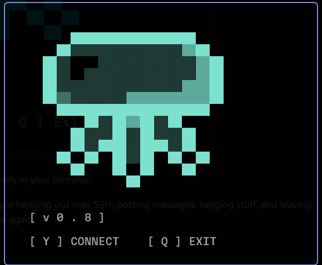
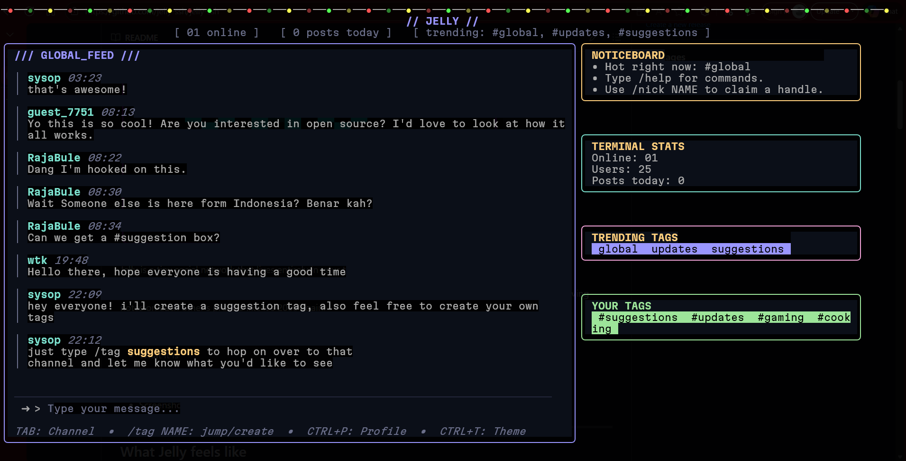
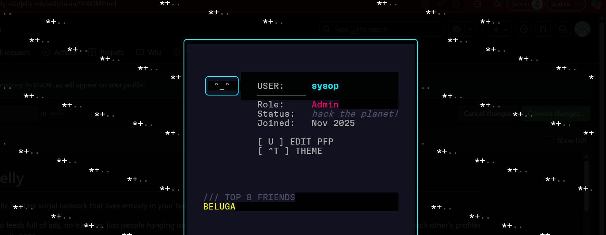

# Jelly 



Jelly is a tiny social network that lives entirely in your terminal.

No feeds full of ads, no tracking; just people hanging out over SSH, posting messages, tagging stuff, and leaving notes on each other’s profiles like it’s 2006 again.

This repo is the **public home** for Jelly:

* What it is
* How to connect
* FAQ / status
* Screenshots & updates

---

## What Jelly feels like

Imagine:

* You open your terminal
* You `ssh` into a weird neon BBS
* There’s a **global feed**, some **trending tags**, cozy **ASCII avatars**, and
* A handful of strangers chatting like they just found a secret room on the internet

That’s the vibe.



---

## How to connect

"if you discover it, you can join." If you can get into an SSH server, you’re in.

### 1️⃣ Generate an SSH key (if you don’t already have one)

Linux / macOS:

```bash
ssh-keygen -t ed25519 -C "jelly"
```

Windows (PowerShell):

```powershell
ssh-keygen -t ed25519 -C "jelly"
```

Accept the defaults and **don’t lose your key**. Jelly uses it as your identity.

### 2️⃣ Connect to Jelly

```bash
ssh jellyssh.xyz
```

* **Auth:** SSH public key only - no passwords, no web signup form
* Your identity is mapped from your SSH **public key fingerprint**
* First join: you get a guest-style username (e.g. `guest_1234`), which you can rename with `/nick`

If your terminal supports decent UTF‑8 and 256‑color/truecolor, you should be fine. (If something looks cursed, try another terminal and let me know in `#feedback`.)

---

## What you can do inside Jelly

### Global feed

* Post messages into a live-updating global timeline
* Scroll back through recent posts

### #Hashtag "channels"

* Use tags like `#tui`, `#feedback`, `#gaming`, etc.
* Switch views by selecting a tag in the sidebar
* When you’re in a tag view, Jelly auto‑appends that tag to your post if you forget
* Feels like lightweight rooms without heavy channel management

###  Profiles



* Every profile has a guestbook
* `/sign message` on someone’s profile to leave a note
* Recent signatures show up on their page
  
* `/status text` – set a short status line under your name
* Profile themes with different animated backgrounds (matrix, snow, inferno, etc.)

### ASCII avatars

* Edit your avatar in a built‑in ASCII editor
* Small size + printable characters only so it renders correctly in lots of terminals

### Top 8

* `/top8 NAME` – add someone to your Top 8
* `/rmtop8 NAME` – remove them
* Shows on your profile (myspace throwback)

### ⌨️ Handy commands

From the main feed:

```text
/help           Show commands
/global / /home Jump back to GLOBAL_FEED
/view NAME      Open another user’s profile
/top8 NAME      Add to Top 8
/rmtop8 NAME    Remove from Top 8
/quit, /exit    Leave Jelly
Ctrl+C          Also leaves Jelly (classic)
```

On profiles:

```text
/sign message   Sign someone’s guestbook
(Your profile)  Typing plain text updates your status
U               Edit your PFP (when viewing your own profile)
Esc             Back to feed
```

---

## Tech stack (for the curious)

Jelly is built to feel like a retro BBS running on a modern stack:

* **Language:** Go
* **Terminal UI:** [Bubble Tea](https://github.com/charmbracelet/bubbletea) + [Lip Gloss](https://github.com/charmbracelet/lipgloss)
* **SSH server:** [Wish](https://github.com/charmbracelet/wish)
* **Auth:** SSH public keys only
* **Rate limiting:** Simple per‑IP sliding window so reconnect spam doesn’t melt the box

---

## Status & roadmap

### Current status

* ✅ Public SSH server
* ✅ People actively hanging out and testing
* ✅ Feels surprisingly cozy already
* 🚧 Features & UX still changing a lot

### Rough roadmap

No promises, but things I’d *like* to explore:

* Better help / onboarding flow for new users
* Soft moderation tools (mutes / filters) that don’t kill the chill vibe
* Optional per‑user notes / "mini blogs" on profiles
* Exportable data / backups

---

## Feedback & bugs

If you’ve tried Jelly and something broke (or was just weird), you can:

* Open an **issue** on this repo
* Or hop into Jelly and drop a note in `#feedback`

Screenshots, terminal info (kitty, iTerm2, Windows Terminal, etc.), and OS details really help when debugging rendering issues.

---

## Support

Right now Jelly is just one person paying for a small box on the internet because it makes me happy.

If you want to support it:

* Show up and hang out
* Tell other terminal‑obsessed friends
* Star this repo so it looks a little less lonely

I may add a donation link (Ko‑fi / Buy Me a Coffee / etc.) here later once things settle down.

---

## Credits

Jelly is built and hosted by a single human who likes:

* terminals
* and the idea that not everything online has to feel like a growth‑hacked product

If that resonates with you, you’re exactly who I built this for.

If you made it this far, you probably already know how to find the server. 


<!--
**jelly-ssh/jelly-ssh** is a ✨ _special_ ✨ repository because its `README.md` (this file) appears on your GitHub profile.

Here are some ideas to get you started:

- 🔭 I’m currently working on ...
- 🌱 I’m currently learning ...
- 👯 I’m looking to collaborate on ...
- 🤔 I’m looking for help with ...
- 💬 Ask me about ...
- 📫 How to reach me: ...
- 😄 Pronouns: ...
- ⚡ Fun fact: ...
-->
